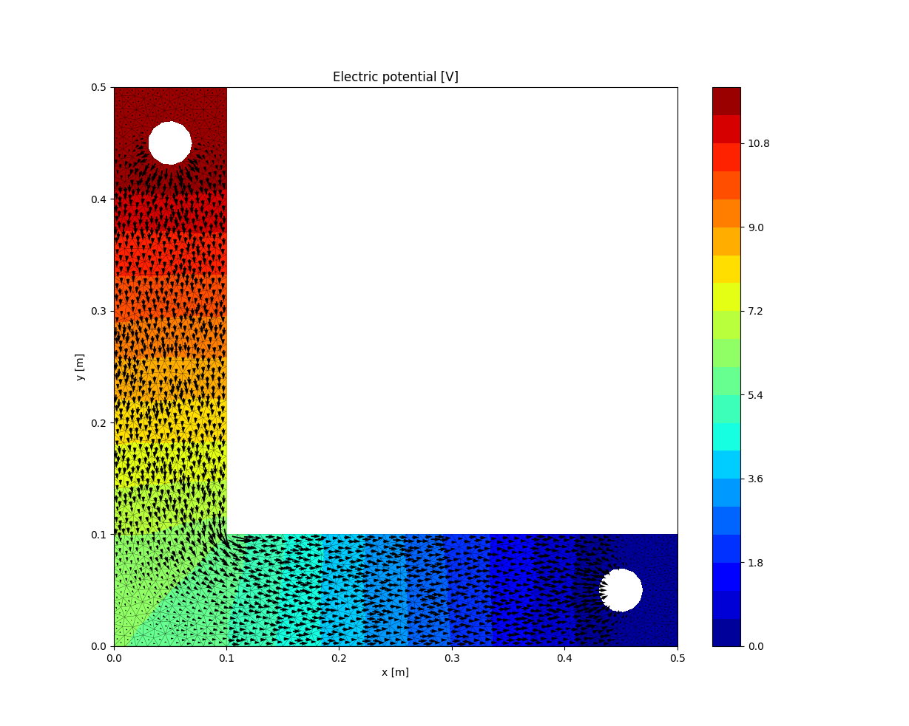

# pyjoule
A 2D Finite Element Method solver for electric conduction analysis

This project is meant to simulate a multiphysics setup field in a 2D finite element environment

1) Define and load geometry (.msh file)
2) Solve for electric potential scalar field (given dirichlet bounday conditions)
3) Solve for electric and current density vector fields
4) Compute the power losses
5) Solve for the temperature distribution

## Other pictures

